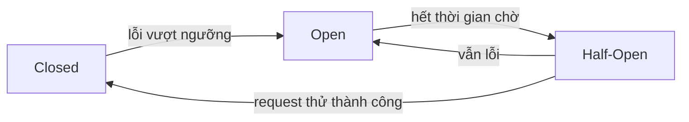

# Circuit Breaker

#type/concept #status/done

## Là gì (1-2 câu)

Pattern bảo vệ hệ thống khỏi lỗi lan truyền: khi một service downstream lỗi liên tục, circuit breaker "ngắt mạch" — trả lỗi ngay lập tức thay vì tiếp tục gọi và chờ timeout.

## Tại sao cần / giải quyết vấn đề gì

Khi service B chết mà service A vẫn gọi B, mỗi request của A bị treo chờ timeout → thread pool của A cạn → A cũng chết theo → lỗi lan cả hệ thống (cascading failure). Circuit breaker chặn chuỗi domino này.

## Cách hoạt động

3 trạng thái:



- **Closed**: hoạt động bình thường, đếm lỗi
- **Open**: chặn mọi request, trả lỗi ngay (fail fast)
- **Half-Open**: cho vài request thử; thành công thì đóng mạch lại

## Trade-off

**Ưu:**
- Fail fast, bảo vệ tài nguyên (thread, connection)
- Cho service lỗi thời gian phục hồi
- Kết hợp được fallback (trả cache, giá trị mặc định)

**Nhược:**
- Thêm độ phức tạp, phải tune ngưỡng (bao nhiêu lỗi thì mở? chờ bao lâu?)
- Ngưỡng sai → mở mạch oan khi chỉ lỗi thoáng qua

## Khi nào dùng

- Gọi service ngoài / API bên thứ ba không kiểm soát được
- Microservices gọi lẫn nhau qua network

## Khi nào KHÔNG dùng

- Gọi hàm nội bộ trong cùng process
- Lỗi mang tính nghiệp vụ (validation) chứ không phải lỗi hạ tầng

## Ví dụ thực tế / Code

Java: Resilience4j

```java
CircuitBreaker cb = CircuitBreaker.ofDefaults("hotelApi");
Supplier<RateResponse> decorated =
    CircuitBreaker.decorateSupplier(cb, () -> hotelApiClient.getRates(req));
```

## Câu hỏi phỏng vấn liên quan

- Circuit breaker khác retry thế nào? Khi nào kết hợp cả hai?
- Ngưỡng mở mạch nên dựa trên error rate hay error count?

## Liên quan

- [[Retry & Backoff]]
- [[Rate Limiting]]
- [[MOC - System Design]]

## Nguồn

- Release It! (Michael Nygard) - chương Stability Patterns
- Resilience4j docs
