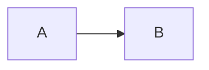

# {{title}}

#type/concept #status/draft

## Là gì (1-2 câu)


## Tại sao cần / giải quyết vấn đề gì


## Cách hoạt động

<!-- Vẽ diagram nếu cần:

-->

## Trade-off

**Ưu:**
- 

**Nhược:**
- 

## Khi nào dùng


## Khi nào KHÔNG dùng


## Ví dụ thực tế / Code

```java

```

## Câu hỏi phỏng vấn liên quan

- 

## Liên quan

- [[]]

## Nguồn

- 
